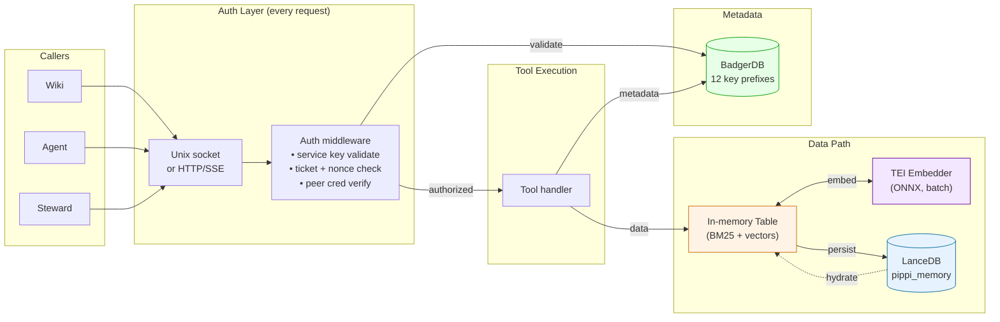
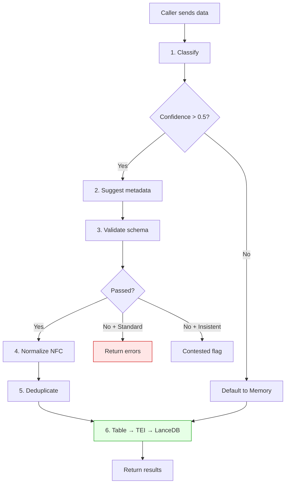

# Pippi Librarian — What It Is and How It Works

**Date:** 2026-04-10 (updated 2026-04-11, R12 cross-link)
**Source:** `frodex/pippi-librarian` standalone repo at `/srv/pippi-librarian/`
**Updated:** 2026-04-11 — SQLite removed, BadgerDB for metadata, LanceDB for data+vectors, TEI embedder
**Planned:** Version-aware memory store ([c6525ac](/projects/default/pages/c6525ac)), extensible schema ([8634f02](/projects/default/pages/8634f02) Phase 1)

## What It Is

From the spec:

> The Knowledge Librarian is Pippi's local knowledge management layer. It sits between raw data sources and the knowledge base.

**The librarian is the only way to read or write data. No direct database access.** Nothing outside the librarian touches the databases. The databases are internal to the librarian — callers don't know or care how data is stored.

## Storage Architecture (as-built 2026-04-11)

Two storage backends. **SQLite completely removed.**

| Backend | What it stores | Why |
|---------|---------------|-----|
| **LanceDB** | All records in one table (`pippi_memory`) — memory, entity, capability with text + vectors. `record_type` column. | Source of truth. Vectors co-located. BM25 + cosine search. |
| **BadgerDB** | Service keys, auth events, profiles, feedback, vocabulary, fast-track, embedding profiles, access logs, transcript state, federation | Concurrent KV. No single-writer bottleneck. |

**Planned (pre-flight item 6):** Entity table merge into `pippi_memory`. See [92657c7](/projects/default/pages/92657c7).

### Diagram 1 — Two request paths

### Diagram 2 — End-to-end

33 tools in 3 groups (6 librarian, 19 domain, 8 steward). Auth hits BadgerDB on every request. Data path: Table ↔ TEI → LanceDB. Startup: BadgerDB instant → HTTP live → LanceDB hydrates in background (30-90s).

---

## How Callers Connect

- **Unix socket** — peer credentials (UID/GID/PID)
- **Loopback HTTP/SSE** — Bearer token
- **Step tickets** — per-operation nonce

## Write Path

**Version writes (planned):** When the version-aware memory store ships, step 6 uses **new-chain-forward** ordering: embed new content first, then Add new head row (new `mem_` ID), then demote old head to superseded. LanceDB has no transactions — the new head is added before the old head is demoted so that a crash never loses the current version. Full ordering rules, crash recovery, and dual-current repair are in [c6525ac](/projects/default/pages/c6525ac).

## Read Path

BM25 lexical + vector cosine → Reciprocal Rank Fusion (k=60) → metadata filters → scored results. If embedder unavailable, BM25 only.

## Embedder

TEI (Text Embeddings Inference), ONNX Runtime, nomic-embed-text-v1.5, 768 dimensions, batch parallelism. Port 8088. Drop-in replacement for llama.cpp (same `/v1/embeddings` API).

## Startup and Recovery

LanceDB in background goroutine. SIGTERM for clean shutdown. After crash: just restart.

## Authority Model

Standard (errors), Insistent (contested flag), Override (admin).

## Stress Test (2026-04-11)

126/126 pages, 100/100 searches, 0 DB errors. TEI: 1.4 pages/s ingest, 92.2 searches/s, true batch parallelism.

## What This Provides for the Wiki

**Available today:** Search (BM25+vector+RRF), classification, ingest with rollback, vocabulary, fast-track, background workers, service keys, auth events, concurrent embedding, crash recovery.

**Spec'd, not yet built:**
- Version-aware memory store — new-chain-forward, ghost records, deep search ([c6525ac](/projects/default/pages/c6525ac))
- Extensible schema — sidecar YAML, ext_json, tool schema merge ([8634f02](/projects/default/pages/8634f02) Phase 1)
- 4-tool memory API — store, search, get, delete with page_uuid addressing ([6ccd407](/projects/default/pages/6ccd407))
- Prior art suggestions, schema validation, deduplication detection (stubs implemented)
