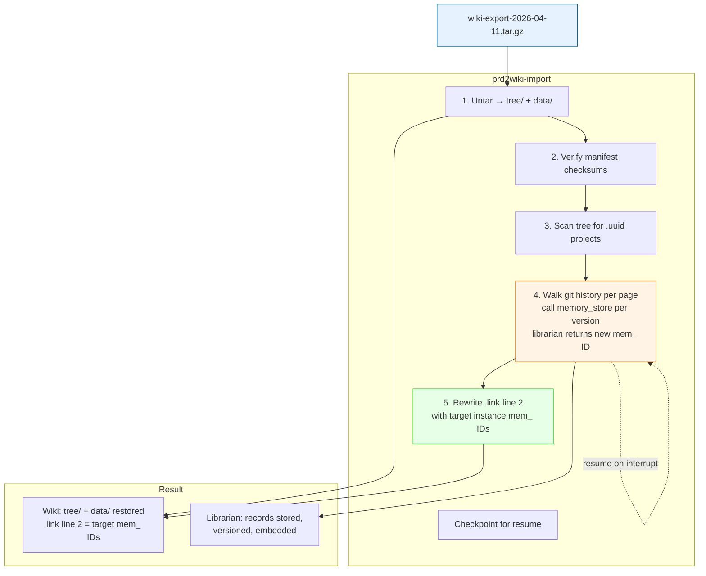
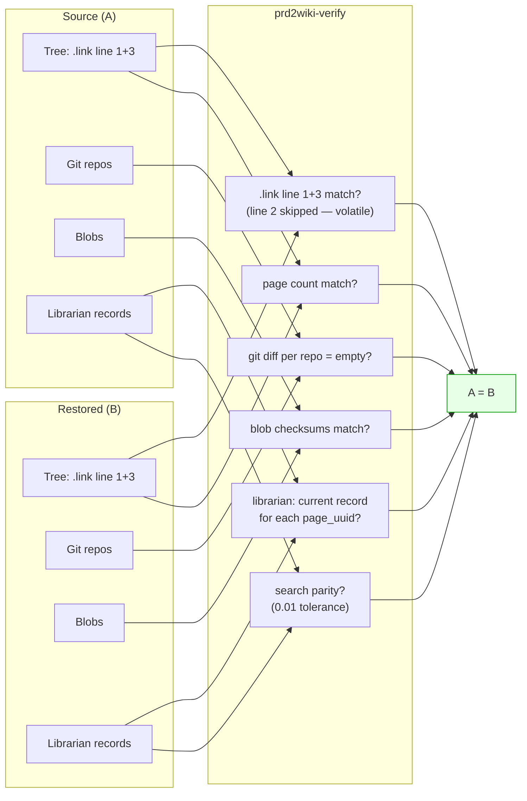

# DESIGN: Wiki Export/Import — Portable Backup and Validation

**Date:** 2026-04-11 (R10: volatile .link line 2 in import/verify)
**Status:** Design — ready for review
**Related:** [Unified Identity](/projects/default/pages/de836ff) (de836ff), [File Map](/projects/default/pages/97a0970) (97a0970), [Version-Aware Memory](/projects/default/pages/c6525ac) (c6525ac)

## Purpose

Three CLI tools. Export produces a single portable file. Import loads it. Verify proves A = B.

## Why Tree Makes This Simple

The entire wiki state lives in `tree/` + `data/`. Everything else is derived.

**Export = `tar czf tree/ data/`**. That's the entire wiki.

## What Gets Exported

| Data | Source | How |
|------|--------|-----|
| Tree structure | `tree/` | Tar as-is (.uuid, .link, .access, redirects) |
| Pages (all versions) | `data/repos/proj_*.git/` | Tar bare repos as-is |
| Binary attachments | `data/blobs/` | Tar as-is |
| Schema extensions | `schema.d/*.yaml` | Copied as `schema/` in bundle |
| Embedder config | Manifest | Model name, dimensions |

**NOT exported:** Librarian records (rebuilt), vectors (recomputed), BadgerDB (rebuilt), service keys (security), index.db (rebuilt).

## Bundle Format

```
wiki-export-2026-04-11.tar.gz
├── manifest.json
├── tree/                        ← .link line 2 values are from source instance
├── data/repos/                  ← bare git repos
├── data/blobs/                  ← content-addressed binaries
└── schema/wiki.yaml
```

**Note on `.link` line 2:** The exported `.link` files contain the source instance's `mem_` head IDs. These are **volatile** — under new-chain-forward versioning, `mem_` IDs change every edit and are unique to each librarian instance. Import step 5 rewrites them with the target instance's IDs after re-ingest.

## Export

```bash
prd2wiki-export --config config/prd2wiki.yaml --output wiki-export-2026-04-11.tar.gz
```

Scans tree for projects, builds manifest with counts + checksums, tars tree/ + data/ + schema/ + manifest.

## Import

```bash
prd2wiki-import \
  --input wiki-export-2026-04-11.tar.gz \
  --target /srv/prd2wiki-restored \
  --librarian-socket /var/run/pippi-librarian.sock \
  --librarian-key psk_...
```



**Step-by-step:**

1. **Untar** — wiki functional immediately (tree provides navigation, repos provide content)
2. **Verify checksums** — manifest integrity
3. **Scan tree** — find all .uuid projects and .link pages
4. **Librarian ingest** — walk git history oldest-first, call `memory_store` per version. Each call returns a new `mem_` head ID (new-chain-forward). Checkpoint per project for resume.
5. **Rewrite `.link` line 2** (R10-1) — after ingest completes for each page, write the **target instance's** current head `mem_` ID back to `.link` line 2. This is the same write-back that `syncToLibrarian` does during normal operation. Without this step, `.link` line 2 still has the source instance's stale IDs.

**Auth:** Unix socket + ticket auth.
**Rate limiting:** 5-worker semaphore.
**Checkpoint:** Per-project. Resume with `--resume`.
**If librarian is down:** Steps 1-3 complete (wiki serves). Steps 4-5 run later with `--resume`.
**If interrupted during step 5:** `.link` files are partially updated. Re-run `--resume` to complete. Pages with stale line 2 still resolve via `page_uuid` (line 1) — the librarian's secondary index handles lookups.

## Verify

```bash
prd2wiki-verify \
  --source /srv/prd2wiki \
  --target /srv/prd2wiki-restored \
  --source-librarian 127.0.0.1:9090 \
  --target-librarian 127.0.0.1:9091
```

### Verification levels

| Level | What it checks | `.link` line 2 handling |
|-------|---------------|------------------------|
| `--quick` | Tree diff (line 1 + 3 only) + manifest counts | **Skipped** — line 2 is volatile |
| `--full` (default) | Quick + per-repo git diff + blob checksums | **Skipped** |
| `--deep` | Full + librarian record count + search parity (0.01 tolerance) | **Compared by page_uuid** — verifies both instances have a current record for each page, ignores `mem_` ID values |

**`.link` line 2 is excluded from tree diff** (R10-1): Line 2 contains `mem_` head IDs that are instance-specific (new IDs generated on each import). Comparing them byte-for-byte would always fail. Verify compares:
- Line 1 (page UUID) — must match
- Line 3 (title) — must match
- Line 2 — **ignored** in tree diff. Deep verify checks that the librarian has a current record for each `page_uuid` instead.



## What This Is NOT

| This is | This is not |
|---------|-------------|
| CLI data loader | Agent or steward |
| Mechanical | Negotiation |
| Offline file | Live sync |
| Backup/restore | Federation |

## Files

```
/srv/prd2wiki/
├── cmd/
│   ├── prd2wiki-export/main.go
│   ├── prd2wiki-import/main.go
│   └── prd2wiki-verify/main.go
├── internal/
│   └── transfer/
│       ├── export.go
│       ├── import.go       # includes step 5: .link line 2 rewrite
│       ├── manifest.go
│       └── verify.go       # .link diff compares line 1+3, skips line 2
```

## Timeline (Phase 5)

| Step | Effort |
|------|--------|
| Transfer package (export + manifest) | 2h |
| Export CLI | 1h |
| Import CLI (untar + verify + ingest + .link rewrite) | 3h |
| Verify CLI (quick/full/deep, line 2 normalization) | 2h |
| End-to-end test | 1h |
| **Total** | **~9h** |
